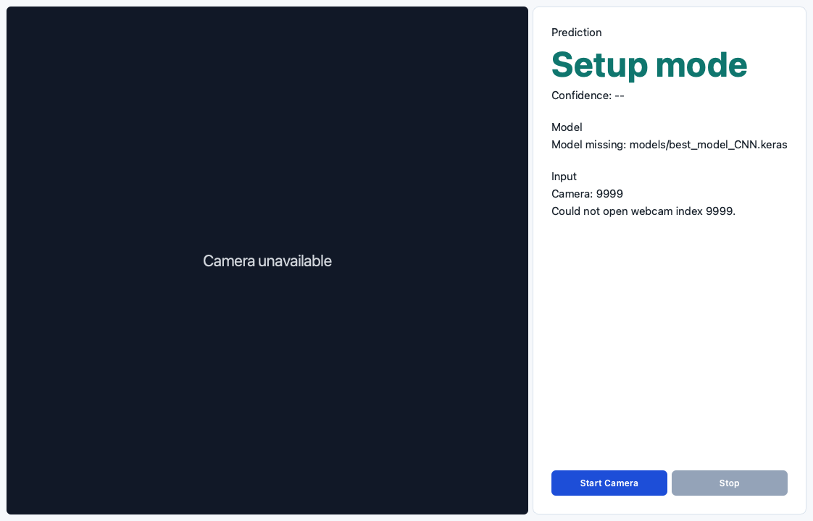
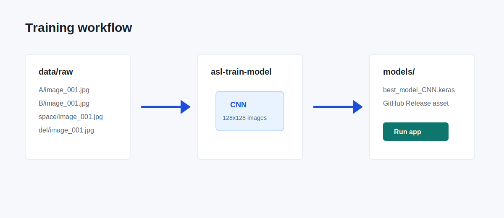

# ASL-to-Text

A desktop app that uses a webcam, MediaPipe hand detection, and a Keras CNN model to translate ASL hand signs into text predictions.



## Features

- PySide6 desktop interface with live webcam preview.
- MediaPipe hand detection and cropped-hand preprocessing.
- Keras model inference for ASL letters plus `space`, `del`, and `nothing`.
- Setup mode when the model file is missing, so the app still opens cleanly.
- Data collection and training commands for adding your own images.

## Project Structure

```text
.
├── src/asl_to_text/        # App, preprocessing, prediction, and training code
├── scripts/                # Source-checkout command wrappers
├── notebooks/              # Original exploratory notebooks
├── docs/assets/            # README images
├── data/raw/               # Local training images, ignored by git
└── models/                 # Local model files, ignored by git
```

## Setup

Python 3.10 or 3.11 is recommended.

```bash
python -m venv .venv
source .venv/bin/activate
pip install --upgrade pip
pip install -e .
```

## Model File

The app expects a trained model at:

```text
models/best_model_CNN.keras
```

Model artifacts are not committed to git. Download `best_model_CNN.keras` from this repository's GitHub Releases page when a release asset is published, then place it in the `models/` folder.

If the model is missing, the desktop app still launches in setup mode and shows camera/model status instead of crashing.

## Run the App

```bash
asl-to-text-app --model models/best_model_CNN.keras --camera 0
```

From a source checkout, this wrapper does the same thing after installation:

```bash
python scripts/run_app.py --model models/best_model_CNN.keras --camera 0
```

Hold one hand in the camera frame. When a hand is detected, the app draws a box around it and sends the cropped hand image to the model.

## Collect Training Images

Use one folder per class label. Each folder name becomes the training label.

```text
data/
  raw/
    A/
      image_001.jpg
      image_002.jpg
    B/
      image_001.jpg
    ...
    Z/
    del/
    nothing/
    space/
```

Capture new webcam images for a label:

```bash
asl-collect-data --label A --name user --output data/raw --camera 0
```

Press `q` in the OpenCV window to stop recording. The collector saves cropped hand images into `data/raw/<label>/`.

## Train a Model

After adding training images, run:

```bash
asl-train-model --data data/raw --output models/best_model_CNN.keras --epochs 10
```

Training writes the best Keras model to the output path and logs TensorBoard data under `logs/`.



## Troubleshooting

- **Camera unavailable:** try a different camera index, such as `--camera 1`.
- **Model missing:** download `best_model_CNN.keras` from GitHub Releases or train your own model.
- **Import errors:** make sure the virtual environment is active and `pip install -e .` completed successfully.
- **Poor predictions:** add more balanced images for each class and retrain the model.

## Notes

The original notebook workflows are preserved in `notebooks/` for reference. The main supported workflow is now the desktop app and CLI commands.
